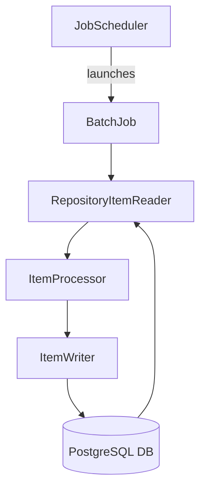
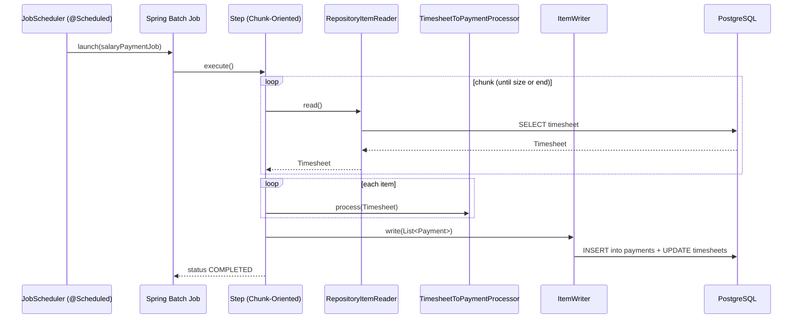

## Batch Processing with Spring Boot, Spring Batch & JPA
Production-style Java solution that showcases scheduled **batch processing** using **Spring Batch**, **JPA**, and **PostgreSQL** — with transactional safety and chunk-oriented processing.

---
## 🗺️ Solution Architecture


## 🧩 Use Case
This batch job processes employee timesheets to compute monthly payouts:

- Reads **approved** and **unprocessed** timesheets
- Calculates payout = salary + overtime – deductions
- Writes the result to a `payments` table
- Marks original timesheets as processed

🕒 The job runs every 60 seconds as a simulation, demonstrating how a scheduled batch could behave in production.


### Sequence diagram:


## 🔐 Key features
- Spring Batch chunk-oriented processing
- JPA-based item reader, writer, and processor
- Periodic job execution via `@Scheduled`
- Built-in logging and error tracking
- Transactional and idempotent processing
- Works with PostgreSQL via Docker Compose

## 📦 Project Structure
```
batch-processing/
├── batch-database/         # PostgreSQL DB + sample data (Dockerized)
├── batch-service/          # Spring Boot batch job (runs every 5 mins)
│   ├── config/             # Transaction config
│   ├── entity/             # Timesheet, Payment JPA entities
│   ├── job/                # Job + Step config
│   ├── processor/          # TimesheetToPaymentProcessor
│   ├── repository/         # Spring Data JPA repositories
│   ├── scheduler/          # JobScheduler (periodic trigger)
│   └── BatchProcessingApplication.java
```


## 🚀 How to Run
### 1. Start the PostgreSQL database
```
cd batch-database
docker-compose up
```
This runs PostgreSQL with schema and 100+ timesheets preloaded.


### 2. Start the Batch Processor
```
./mvnw -pl batch-processing/batch-service spring-boot:run
```

### Once started:
- The batch job runs immediately on startup, and then every 5 minutes
- Timesheets will be processed in chunks of 10
- Payments will be inserted into the payments table
- Timesheets are marked as processed
- Logs will show job start, end, and item-level processing

- PostgreSQL runs on ```jdbc:postgresql://localhost:5432/batch_db```

## 🔬 Automated Testing

This module includes unit and integration tests to verify end-to-end batch processing logic using realistic data.

### Testing Highlights

- **H2 in-memory database** configured in test scope (`MODE=PostgreSQL`) for schema compatibility
- **`@DataJpaTest`** for repository unit tests
- **Step-level tests** using `@SpringBatchTest` and `JobLauncherTestUtils`
- Schema auto-created using `spring.jpa.hibernate.ddl-auto=create-drop`

No need for Docker or PostgreSQL during test execution — H2 handles all test persistence in-memory.