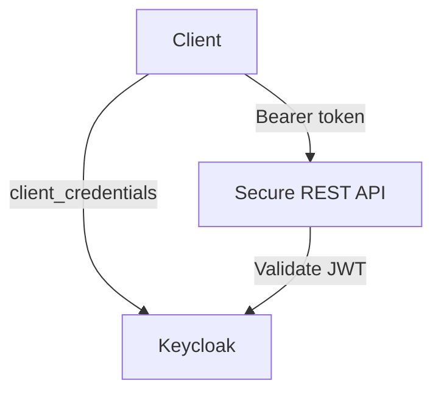
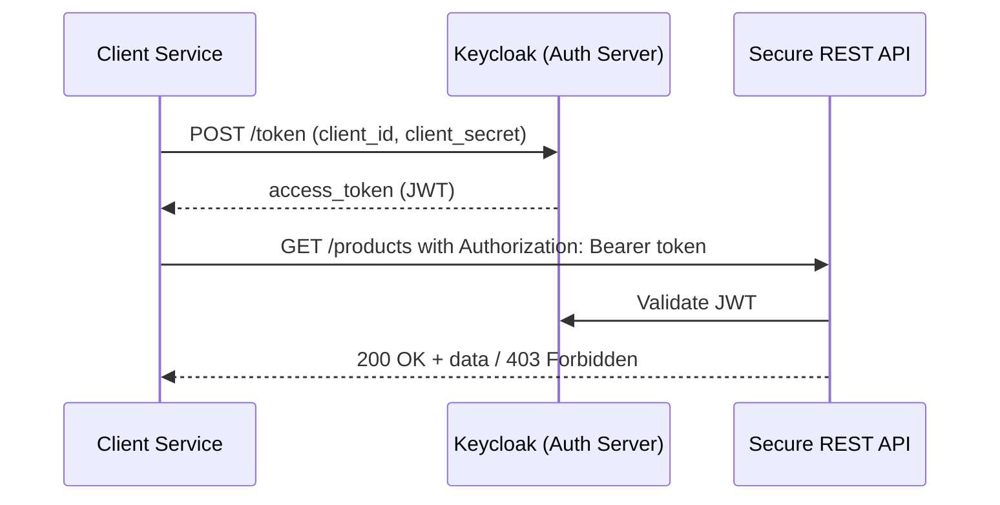

# Secure REST API with Spring Boot and Keycloak

Production-inspired Java solutions demonstrating how to secure backend APIs using modern OAuth2 and Zero Trust principles — with **Spring Boot**, **Keycloak**, and **JWT-based authentication**.

---
## 🗺️ Solution Architecture



## 🧩 Use Case

This solution simulates a common **backend-to-backend integration scenario**, where one service securely calls another using OAuth2 and role-based access control.

For instance: A background job or microservice needs to access a secure API without user interaction.

### Sequence diagram:


## 🔐 Key features

-  Secure REST API with stateless JWT validation
-  Keycloak-based authentication and role-based authorization
-  Service-to-service token exchange via OAuth2 client credentials
-  Spring Security with custom JWT role mapping
-  Minimal, clean, and modular layout for easy extension and contribution


## 📦 Project Structure
```
secure-rest-api/
├── secure-rest-api-auth-server     # Keycloak config and docker-compose
├── secure-rest-api-server          # Spring Boot API with JWT validation
├── secure-rest-api-client          # Standalone service client
```


## 🚀 How to Run
### 1. Start Keycloak
```
cd secure-rest-api-auth-server
docker-compose up
```
### 2. Start the API server
```
./mvnw -pl secure-rest-api/secure-rest-api-server spring-boot:run
```
### 3. Run the API client
```
./mvnw -pl secure-rest-api/secure-rest-api-client spring-boot:run
```


### Once started:

- Keycloak runs on ```http://localhost:8081```

- API server runs on ```http://localhost:8080```


---
## 🧪 Manual testing
1. **Get a Token** from Keycloak (Client Credentials). Using POSTMAN or curl:
```
curl -X POST http://localhost:8081/realms/demo/protocol/openid-connect/token \
  -H "Content-Type: application/x-www-form-urlencoded" \
  -d "grant_type=client_credentials" \
  -d "client_id=secure-rest-api" \
  -d "client_secret=secure-api-secret"
```
This will return a JSON object with an **access_token**.

2. **Call the API** using POSTMAN or curl:
```
curl -H "Authorization: Bearer <PASTE_TOKEN_HERE>" \
  http://localhost:8080/products
```
If the token has the proper role (READER), this returns a JSON list of products.

3. **Call Without Token** (for demo)
```
curl http://localhost:8080/products
```
You should get HTTP 401 Unauthorized.